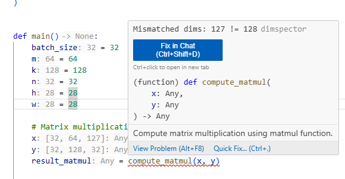

<h1 align="center">dimspector</h1>
A development tool that statically infers tensor shapes for PyTorch programs to provide shape hints and catch bugs. 

  

__This project is still largely in development; the set of Python/PyTorch programs dimspector can analyze is currently patchy but growing.__



## Usage

### Running Analysis

```
# run standalone check on project or file
cargo run -- check path/to/project/root

# start LSP server
cargo run -- server
```

### Running tests
```
cargo insta test
```