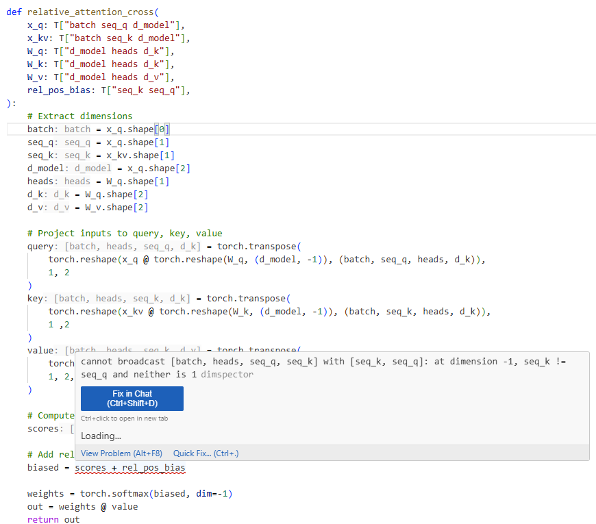

<h1 align="center">dimspector</h1>
A development tool that statically infers tensor shapes for PyTorch programs to provide shape hints and catch bugs. 

  

__This project is still in development. The subset of Python it can handle is patchy, but growing, and a VSCode extension and general LSP implementation will be available soon.__



## How it works
1. Add tensor shape annotations to parameters using [jaxtyping](https://github.com/patrick-kidger/jaxtyping/) (see above example). 
2. Get inlay hints for inferred shapes and diagnostics for shape mismatches before running your code. 

### Dimension Variable Symbolic Expressions
```python
def concat_features(x: Float[Tensor, "b n d"], y: Float[Tensor, "b n e"]) -> Float[Tensor, "b n d+e"]:
    return torch.cat([x, y], dim=-1)
```
Supports symbolic (ex. `batch`), concrete (ex. `64`), addition (`d_model-1`), and multiplication (ex. `batch*d_model`) dimension variables. 


## Usage

### Run the analysis

```
# run standalone check on project or file
cargo run -- check path/to/project/root

# start LSP server
cargo run -- server
```

### Run tests
```
cargo insta test
```